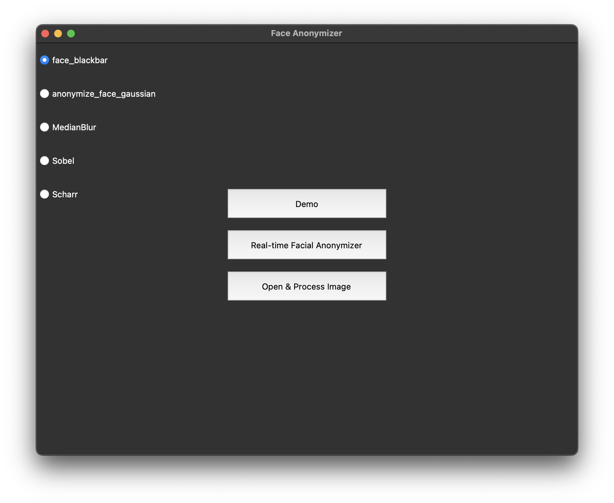
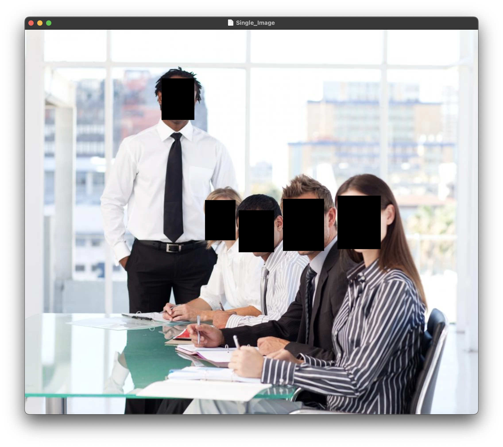

# Facial Anonymizer

## File Structure

`facial_anonymizer.py` is the main python program.

`requirements.txt` Python dependencies.

`images/` folder contains several sample images for testing.

`Dockerfile` is to create docker containers

`deployment.yaml` is to give instructions to kubernetes in regards to deployment.

## How to Run

In the terminal, run:

```
python3 -m pip install -r requirements.txt
python3 facial_anonymizer.py
```

A Python GUI window should pop up and the terminal output would output the following text (could be varied on a different platform):



```
2022-08-03 23:18:28.187280: I tensorflow/core/platform/cpu_feature_guard.cc:151] This TensorFlow binary is optimized with oneAPI Deep Neural Network Library (oneDNN) to use the following CPU instructions in performance-critical operations:  AVX2 FMA
To enable them in other operations, rebuild TensorFlow with the appropriate compiler flags.
```

### Demo

The "Demo" mode will display an image being processed with the chosen image. For example, by default, we have the "face_blackbar" filter selected, and clicking "Demo" will show us:



To test a different image, go to line 175 and change the name of the file to whatever picture name that you want to run as ""./name of the photo"

For demo to work, you have to select a type of blur. If you don't, it will give an error.

### Real-Time Facial Anonymizer

In this mode, the program will be processing the camera feed with the applied filter in real-time:


### Open & Process Image

This mode would allow users to open a single image and apply the selected filter.


